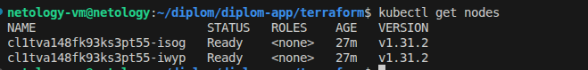
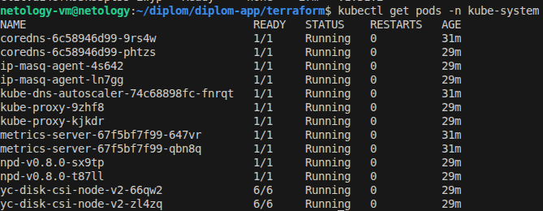
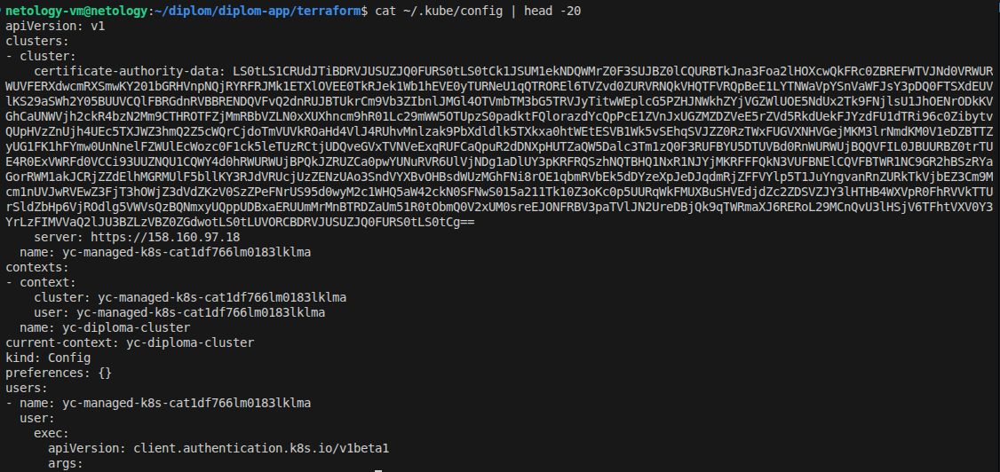
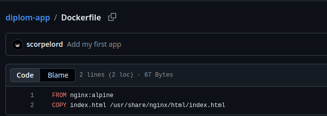
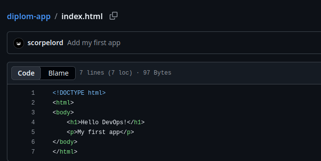
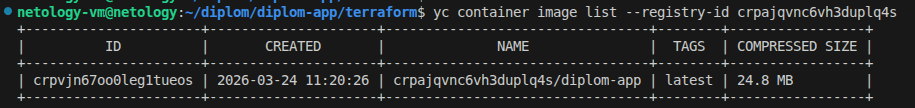
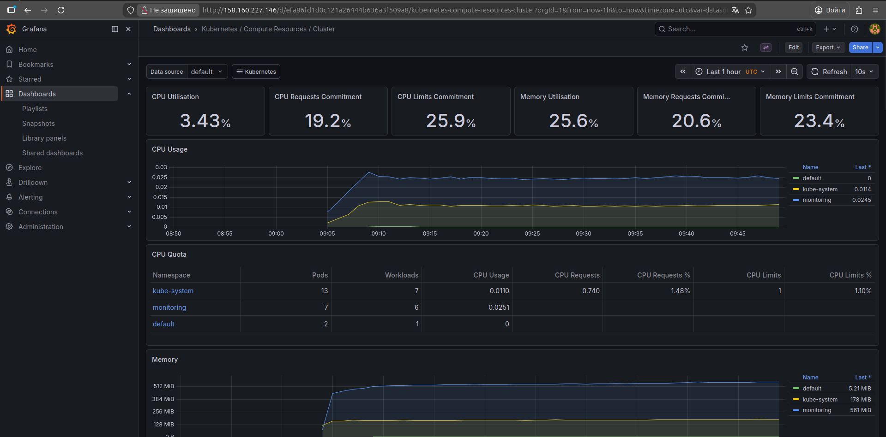
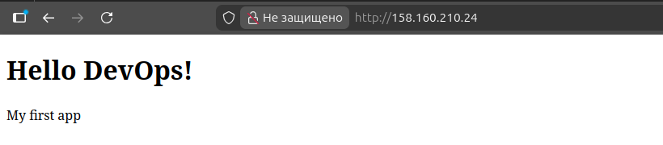
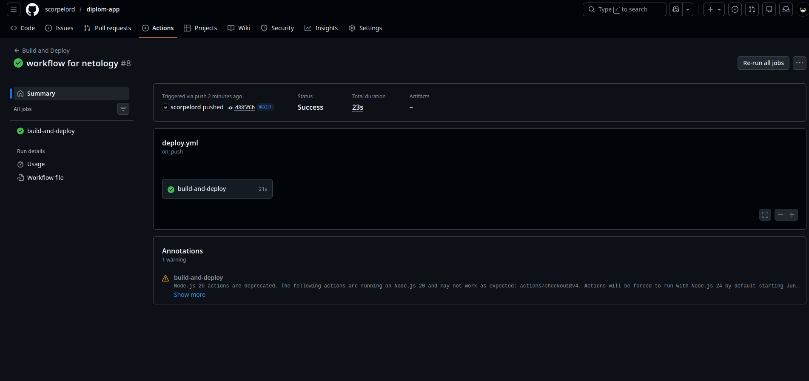

<div align="center">
  <h1>🎓 Дипломный проект: Облачная инфраструктура в Yandex.Cloud</h1>
  <p><strong>Выполнял:</strong> Молоствов Андрей</p>
  <p>
    
    
    
    
    
  </p>
</div>

---

## 📋 Оглавление
- [☁️ Создание облачной инфраструктуры](#️-создание-облачной-инфраструктуры)
- [⚙️ Создание Kubernetes кластера](#️-создание-kubernetes-кластера)
- [🐳 Создание тестового приложения](#-создание-тестового-приложения)
- [📊 Система мониторинга](#-система-мониторинга)
- [🚀 Деплой приложения](#-деплой-приложения)
- [🔄 Настройка CI/CD](#-настройка-cicd)

---

## ☁️ Создание облачной инфраструктуры
Вся сетевая и базовая инфраструктура создана с помощью **Terraform**.

| Ресурс | Название | Описание |
|--------|----------|----------|
| **VPC сеть** | `diploma-net` | Основная сеть проекта |
| **Подсети** | `ru-central1-a`, `b`, `d` | Три подсети в разных зонах доступности |
| **Группа безопасности** | `k8s-sg` | Правила для кластера Kubernetes |
| **Сервисный аккаунт** | `k8s-sa` | С необходимыми ролями для управления ресурсами |
| **Кластер K8s** | `diploma-cluster` | Управляемый кластер Managed Kubernetes |
| **Группа worker-нод** | `worker-nodes` | 2 прерываемые ВМ (2 vCPU, 4 ГБ RAM) |

> [!NOTE]
> State-файл Terraform в данный момент хранится **локально**. В планах — перенести его в удалённое хранилище (S3 bucket).

<div align="center">
  <a href="./images/vpc">
    
  </a>
</div>

---

## ⚙️ Создание Kubernetes кластера



**Кластер diploma-cluster (версия 1.31) содержит 2 worker-ноды в статусе Ready. Ноды являются прерываемыми (preemptible) для экономии ресурсов, развёрнуты в зоне ru-central1-a.**

---



**Все системные компоненты (CoreDNS, kube-proxy, metrics-server, Yandex Disk CSI driver) работают штатно, статус Running.**

---



**Файл `~/.kube/config` содержит данные для подключения к кластеру diploma-cluster через внешний endpoint. Аутентификация настроена через Yandex Cloud CLI.**

- **Версия кластера:** 1.31
- **Количество worker-нод:** 2 (статус `Ready`)
- **Зона размещения:** `ru-central1-a`
- **Тип нод:** Прерываемые (`preemptible`) для оптимизации затрат

**Статус системных компонентов:**
```bash
# Все системные поды работают штатно
CoreDNS         ✅ Running
kube-proxy      ✅ Running
metrics-server  ✅ Running
Yandex Disk CSI ✅ Running
```

<a name="#-создание-тестового-приложения"></a>
## 🐳 Создание тестового приложения





**Репозиторий `scorpelord/diplom-app` содержит Dockerfile на основе nginx:alpine и index.html с тестовой страницей.**

---



**Приложение представляет собой простой веб-сервер на базе nginx:alpine.**

* Репозиторий: scorpelord/diplom-app
* Dockerfile: на основе nginx:alpine
* Образ: diplom-app:latest

**Сборка и публикация образа:**
```
# Сборка образа
docker build -t diplom-app:latest .

# Тегирование для Yandex Container Registry
docker tag diplom-app:latest \
  cr.yandex/crpajqvnc6vh3duplq4s/diplom-app:latest

# Публикация в registry
docker push cr.yandex/crpajqvnc6vh3duplq4s/diplom-app:latest
```
<a name="#-система-мониторинга"></a>
## 📊 Система мониторинга


Установлен `kube-prometheus-stack` через Helm. Grafana доступна по внешнему IP через LoadBalancer. На скриншоте отображён дашборд **Kubernetes / Compute Resources / Cluster**, демонстрирующий состояние кластера, метрики нод и потребление ресурсов.

**Доступ к Grafana:**

| Параметр | Значение |
|--------|----------|
| **URL** | `http://158.160.227.146` | 
| **Логин** | `admin` |
| **Пароль** | `admin123` | 

Настроен дашборд **Kubernetes / Compute Resources / Cluster**, который отображает:

* Состояние кластера
* Метрики worker-нод
* Потребление ресурсов (CPU, RAM)

<a name="#-деплой-приложения"></a>
## 🚀 Деплой приложения



**Приложение развёрнуто в кластере через Deployment (2 реплики) и доступно из интернета через LoadBalancer. Используется образ cr.yandex/crpajqvnc6vh3duplq4s/diplom-app:latest.**

**Конфигурация деплоя:**
| Параметр | Значение |
|--------|----------|
| **URL** | `http://158.160.210.24` | 

<a name="настройка-cicd"></a>
## 🔄 Настройка CI/CD



Автоматизация сборки и доставки настроена с помощью **GitHub Actions.**

**Workflow:**

1. Триггер: Пуш в ветку main
2. Действия:
    * Сборка Docker-образа
    * Публикация образа в Yandex Container Registry

> [!NOTE]
> Последний запуск workflow завершился зелёным (успешно). Скриншот прилагается в репозитории.
